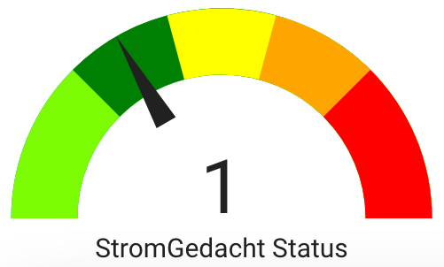

_(Find the [English project description](#stromgedacht-api-sensor-for-home-assistant) below)_

## StromGedacht API-Sensor für Home Assistant

In der Datei [sensor.yml](sensor.yml) wird ein Sensor definiert, der die Status-Daten von der StromGedacht API (Netzauslastung bei TransnetBW) abfragt.

Diese Information kannst Du nutzen, um z.B. temporär das Laden Deines Elektroautos an der Wallbox während einer Hochlastphase zu pausieren. Damit ermöglichst Du dem Netzbetreiber einen einfacherern Lastausgleich. Beim Wert "supergrün" wird ein hoher Anteil der Stromerzeugung durch CO2-neutrale Energiequellen wie Wind und Sonne gedeckt, daher ist es sinnvoll, planbaren Verbrauch in diese Zeiten zu verschieben.

Mögliche Werte des Sensors sind:

- `-1`= supergrün
- `1` = grün
- `3` = orange
- `4` = rot

Zur Konfiguration Deines Standorts ersetze die Postleitzahl (PLZ) in der Sensorkonfiguration (`zip`) durch die PLZ des gewünschten Standorts: `zip=76131`

Eine Beispiel-Karte für das Lovelace-Dashboard findest Du in der Datei [simple_lovelace_gauge.yml](simple_lovelace_gauge.yml).

Ideen oder Bug Reports kannst Du [hier](issues/) eintragen.

Copyright (c) 2023–2025 by [Jean Pierre Wenzel](https://github.com/jpwenzel/).

Weitere Infos findest Du hier:

- StromGedacht (TransnetBW): <https://www.stromgedacht.de/>
- StromGedacht API-Dokumentation: <https://api.stromgedacht.de/>
- Home Assistant Sensor-Konfiguration: <https://www.home-assistant.io/integrations/sensor/>

## StromGedacht API sensor for Home Assistant

Use the sensor defined in [sensor.yml](sensor.yml) to provide information about TransNet electrical grid load.

Based on this load, you can decide to temporarily turn of energy consuming devices, e.g., your EV car charger, to allow for easier grid balancing for the provider. The value "supergreen" indicates an increased share of CO2-neutral sources in power production, e.g., by solar panels and wind turbines, and power consumption should probably be expedited/postponed to this time frame.

Available states are:

- `-1` = supergreen
- `1` = green
- `3` = amber/orange
- `4` = red

To configure the location for which data is requested, replace the `zip` parameter with the German ZIP code of the location you're interested in: `zip=76131`

You can find a simple gauge to be used with the Lovelace dashboard in [simple_lovelace_gauge.yml](simple_lovelace_gauge.yml).

Ideas or bugs can be reported [here](issues/).

Copyright (c) 2023–2025 by [Jean Pierre Wenzel](https://github.com/jpwenzel/).

More info:

- StromGedacht (TransnetBW): <https://www.stromgedacht.de/>
- StromGedacht API documentation: <https://api.stromgedacht.de/>
- Home Assistant sensor configuration: <https://www.home-assistant.io/integrations/sensor/>
